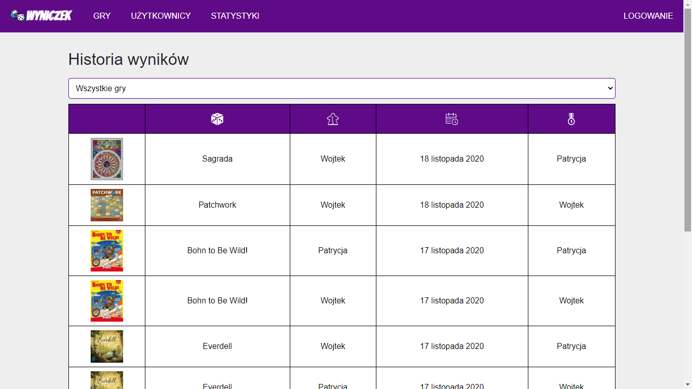

# Wyniczek

## Table of contents

- [Demo](#demo)
- [Description](#description)
- [Technologies](#technologies)

## Demo

[Wyniczek](https://wyniczek.herokuapp.com/)

## Description

Wyniczek is a web application for adding board game results. It allows you to create your own game list, add users and results. Wyniczek provides many statistics such as the number of games played, the date of the last game and many more.  

## Technologies
### Frontend
- HTML
- CSS
- JavaScript (ES6+)
- React
- create-react-app
- Custom Hooks
- Styled components
- Redux (reduxjs/toolkit)
- Redux Saga
- React Router
### Backend
- Node.js
- Express
- MongoDB (Mongoose)
- JWT

### Authors:
- [Wojciech Knott](https://github.com/wknott)
- [Hobosoccer](https://github.com/hobosoccer)
